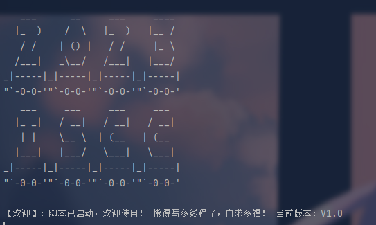
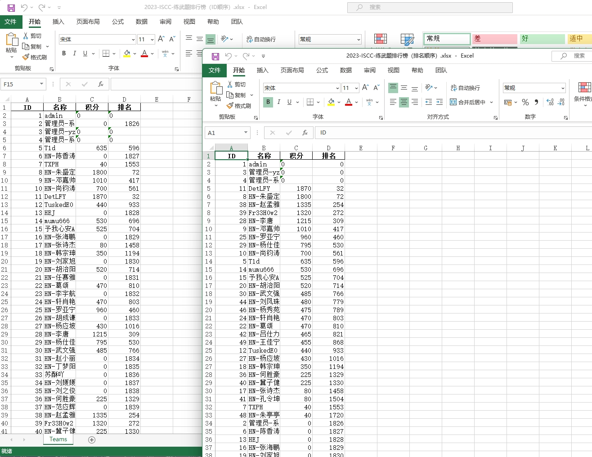

# 关于项目

本项目是打ISCC无聊的时候写的，使用Python来爬取ISCC比赛期间的总排行榜。

目前ISCC2023注册人数应该是在4216人左右，基本上跑就跑4300人即可。

# 依赖库

requests、bs4、pandas、xlsxwriter

使用pip安装即可

哪里不行装哪里

# 使用方法

安装完上述依赖库执行main.py等待结果即可。
## 关于赛区
因为采用了不同赛区，官方的方法是以前缀进行分类，我们也对其进行前缀分类即可。
执行mian.py 能够生成全部的排名，henan.py则是河南赛区，其他类似。

daxuesheng.py - 大学生赛区 \
GRD.py - 研究生赛区 \
GX.py - 广西赛区 \
henan.py - 河南赛区 \
main.py - 全部赛区 \
nycc.py - 中小学生赛区 \
lilunti.py - 理论题 

没写多线程，如果想多线程可以让AI帮你去优化，我觉得没必要，而且会徒增比赛平台压力，按需跑就行。

讲究的就是：**比赛一个不落，赛题一个不解，主打的就是一个陪伴。**

前面几个是0是因为想最大兼容账号，ISCC的平台会设置不显示排行榜，后端接口应该返回的是Null，前端给null识别为空，所以我这里就没有跳过，而是对符合要求的都进行了计算，不影响实际功能。（产品特性）

排行榜中，ID是注册序号，也就是存在于数据库里的用户ID，名称是用户名，积分是得分，排名是ISCC平台给出的排名。

# 鸣谢
不鸣笛了，我感谢感谢：
https://github.com/Moxin1044/ISCC2023-leaderboard/issues/1
感谢：tzf1003 师傅提交的#1 issues 已修复